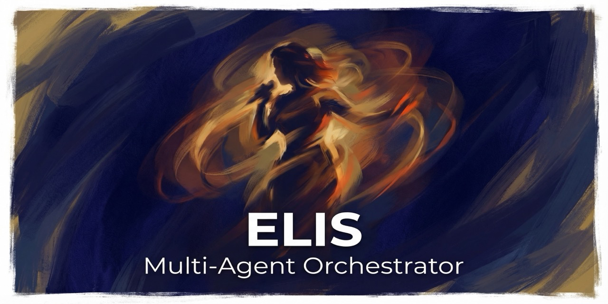

<div align="center">



# ELIS

**Multi-agent orchestrator for Claude Code — 10+ agents across 6 layers, from idea to deployed product**

[](LICENSE)
[](https://claude.ai)
[](docs/agents.md)
[](#the-6-layers)

*Named after [Elis Regina](https://en.wikipedia.org/wiki/Elis_Regina) (1945-1982), Brazil's greatest singer.
Like a maestro conducting an orchestra, ELIS orchestrates specialized AI agents to create world-class web applications.*

[Install](#quick-start) · [Architecture](#the-6-layers) · [Commands](#commands) · [PRD Loop](#autonomous-mode-prd-loop) · [Contributing](#contributing)

</div>

---

## What It Does

One prompt. Six layers. Ten+ agents. Full-stack delivery.

Describe your product idea. ELIS breaks it into phases and delegates across specialized agents — from market research through design, build, test, deploy, and monetization.

```bash
/elis full "A SaaS landing page for an AI writing tool with waitlist and Stripe billing"
```

ELIS runs Scout for market research, Designer + UXer in parallel for the visual system, Builder for production code, Tester for quality gates, Deployer for Vercel, and Stripe for payments. You get a deployed, monetized product.

**The fundamental rule:** ELIS never writes code directly. It plans, delegates, synthesizes, and enforces quality gates. Every agent has a structured contract ("partitura") defining inputs, outputs, and pass/fail criteria.

## The 6 Layers

```
                          ┌──────────────────┐
                          │      ELIS        │
                          │   Conductor      │
                          │     (Opus)       │
                          └────────┬─────────┘
                                   │
    ┌──────────┬──────────┬────────┴────────┬──────────┬──────────┐
    ▼          ▼          ▼                 ▼          ▼          ▼
 DISCOVERY   DESIGN     BUILD           BACKEND    DEPLOY    BUSINESS
```

### Layer 1: Discovery

| Agent | Model | Purpose |
|-------|-------|---------|
| **Scout** | Haiku | Market research, competitor analysis, viability scoring, tech stack recommendation |
| **Analyzer** | Haiku | Technical deep-dive, architecture assessment |

### Layer 2: Design

| Agent | Model | Purpose |
|-------|-------|---------|
| **Designer** | Sonnet | Design systems — HSL colors, typography scales, spacing, effects, animations |
| **UXer** | Sonnet | Nielsen heuristics (scored), WCAG audit, AIDA journey, conversion analysis |
| **Animator** | Sonnet | Framer Motion, CSS animations, micro-interactions, reduced-motion fallbacks |

### Layer 3: Build

| Agent | Model | Purpose |
|-------|-------|---------|
| **Builder** | Sonnet | Production code — HTML, Next.js, or Astro. Responsive, semantic, accessible |
| **Tester** | Sonnet | Playwright E2E, visual regression, accessibility audit, performance checks |

### Layer 4: Backend

| Agent | Model | Purpose |
|-------|-------|---------|
| **Supabase** | Sonnet | Schema design, Row Level Security policies, Edge Functions, auth, storage |

### Layer 5: Deploy

| Agent | Model | Purpose |
|-------|-------|---------|
| **Deployer** | Sonnet | Vercel config, GitHub Actions, environment variables, domain setup, preview deploys |

### Layer 6: Business

| Agent | Model | Purpose |
|-------|-------|---------|
| **Stripe** | Sonnet | Checkout sessions, subscriptions, webhook signature verification, Customer Portal |
| **Launcher** | Sonnet | SEO meta/OG tags, sitemap, robots.txt, analytics, launch checklist |

## Commands

| Command | What It Runs |
|---------|-------------|
| `/elis full <description>` | All 6 layers end-to-end |
| `/elis analyze <url>` | Scout + Analyzer + Designer synthesis |
| `/elis design <description>` | Scout, Designer + UXer in parallel, approval gate |
| `/elis build <spec>` | Builder, Animator, Tester, quality gate |
| `/elis deploy` | Deployer + Launcher |
| `/elis monetize` | Stripe integration + testing |

### Options

```
--reference <url>       Reference site for Scout/Designer
--stack <html|next|astro>  Output framework (default: html)
--output <path>         Output directory
--with-backend          Activate Supabase layer
--with-payments         Activate Stripe layer
--style <minimal|bold|playful|professional>
```

## Contract System

Every agent operates under a structured contract ("partitura"):

```json
{
  "model": "sonnet",
  "input_contract": {
    "required": ["project_description", "target_audience"],
    "optional": ["reference_url", "style_preference"]
  },
  "output_contract": {
    "format": "json",
    "schema": { "design_tokens": {}, "color_palette": [], "typography": {} }
  },
  "quality_gates": ["wcag_aa_contrast", "mobile_responsive", "lighthouse_90"],
  "timeout_ms": 120000,
  "max_retries": 3
}
```

When quality gates fail: retry (up to 3x) → escalate with context → request human input → fallback → graceful degradation.

## Quick Start

### Install

```bash
git clone https://github.com/xiapeli/elis.git
cd elis

# Copy the skill (won't overwrite existing files)
mkdir -p ~/.claude/commands
cp -n elis.md ~/.claude/commands/
```

### Use

```bash
# Open Claude Code and run:
/elis full "A portfolio site for a photographer with dark theme and contact form"

# Analyze an existing site:
/elis analyze https://example.com

# Design only:
/elis design "A meditation app landing page" --style minimal
```

## Autonomous Mode (PRD Loop)

ELIS includes a PRD-driven autonomous loop for hands-off development. Define user stories in `prd.json`, and ELIS implements them one by one:

```bash
cd prd-loop
cp prd.json.example prd.json  # edit with your stories
./elis-loop.sh 10             # run up to 10 iterations
```

Each iteration reads the PRD, implements the next story, commits, and logs progress. Stops when all stories pass or max iterations reached.

> **Note:** The loop uses `--dangerously-skip-permissions` for autonomous operation. Review [prompt.md](prd-loop/prompt.md) before running.

## Design Standards

ELIS ships with opinionated 2026 design defaults:

- **Gradient orbs** — 80-150px blur, 20-30% opacity
- **Bento grids** — asymmetric layouts, 16-24px gaps
- **Expressive typography** — 48-96px headlines, serif+sans pairing
- **Glass morphism** — 8-16px blur, white/5-10%
- **Noise textures** — SVG-based, 3-8% opacity
- **Micro-interactions** — lift on hover, scale on press, glow on focus
- **Mandatory `prefers-reduced-motion`** fallback on all animations

See [docs/customization.md](docs/customization.md) to override defaults.

## Documentation

- [docs/agents.md](docs/agents.md) — Full agent reference
- [docs/contracts.md](docs/contracts.md) — Contract system specification
- [docs/customization.md](docs/customization.md) — How to customize ELIS
- [examples/](examples/) — Full walkthrough examples (SaaS, portfolio, startup)

## Requirements

- [Claude Code](https://claude.ai) with API access
- Claude Opus for the orchestrator
- Claude Sonnet/Haiku for sub-agents

## Contributing

Contributions welcome. Ideas:

- New agents (Analytics, Copywriter, SEO specialist)
- Design standard presets (brutalist, corporate, playful)
- Example PRDs for common project types
- Translations for agent prompts
- Integration tests for the contract system

Open an issue or submit a PR. Follow conventional commits (`feat:`, `fix:`, `docs:`).

## License

[MIT](LICENSE) — Phelipe Xavier, 2026
